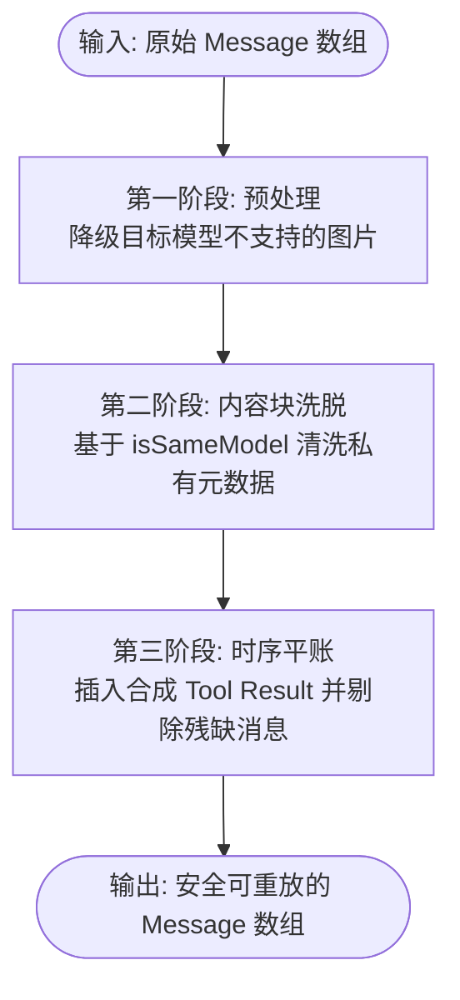
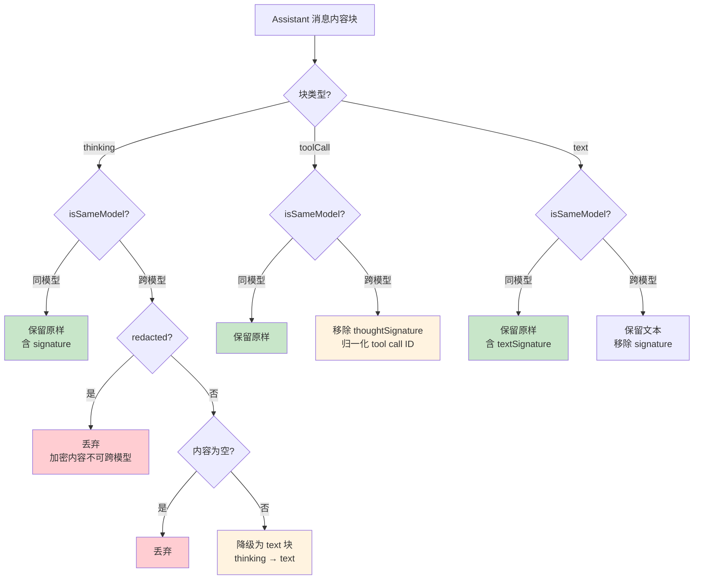

# 第 5 章：消息变换 — 跨模型交接的隐藏复杂度

> **定位**：本章解析用户在不同 LLM 之间切换时，历史消息如何被有损但安全地变换。
> 前置依赖：第 4 章（Provider Registry）。
> 适用场景：当你想理解为什么跨 provider 对话不只是"换个 API key"，或者想为自己的系统设计消息兼容性层。

## 用户在 Claude 上聊了 50 轮，现在要切到 GPT — 历史消息怎么办？

这是本章的核心设计问题。

直觉上，LLM 消息就是"角色 + 文本"。但实际上，每家厂商的消息格式都携带了 provider 特有的元数据：

- **Thinking blocks**：Anthropic 的 extended thinking 和 OpenAI 的 reasoning 是加密的、不可跨模型复用的
- **Tool call IDs**：OpenAI Responses API 生成 450+ 字符的 ID（带 `|` 等特殊字符），Anthropic 要求 ID 匹配 `^[a-zA-Z0-9_-]+$`（最多 64 字符）
- **Thought signatures**：Google 的 tool call 携带 `thoughtSignature`（用于思维链上下文复用），其他 provider 不认识
- **Text signatures**：OpenAI 的 text block 携带 `textSignature`（消息元数据，legacy ID 或 `TextSignatureV1` JSON），跨模型时毫无意义
- **Redacted thinking**：安全过滤后的加密内容，只有原模型能解码

`transformMessages()` 函数用 220 多行代码解决了这些问题。它的策略可以概括为一句话：**尽可能保留，不能保留的安全降级，绝不让变换导致 API 调用失败。**

## 变换策略：三步走的防御性清洗

随着多模态支持和容错场景的增加，`transformMessages` 已经演进为了一个包含三个阶段（Three-Pass）的处理流水线。整体架构如下：



其中，最为核心的**第二阶段（内容块洗脱）**，其判断逻辑围绕一个布尔值 `isSameModel` 展开：

```typescript
// packages/ai/src/providers/transform-messages.ts:92-95

const isSameModel =
  assistantMsg.provider === model.provider &&
  assistantMsg.api === model.api &&
  assistantMsg.model === model.id;
```

这不是简单的"同 provider"判断 — 它要求 provider、api、model ID 三者完全一致。同一个 provider 的不同模型（比如 `claude-sonnet-4-6` 和 `claude-opus-4-6`）也被视为"不同模型"。基于这个判断，针对 `Assistant` 消息中各个具体内容块的洗脱策略如下：



### 图片降级（Image Downgrade）：预处理步骤

在进行各内容块的具体变换之前，系统会首先进行一次“预处理”：降级不支持的图片。

```typescript
// packages/ai/src/providers/transform-messages.ts:35-46

function downgradeUnsupportedImages<TApi extends Api>(messages: Message[], model: Model<TApi>): Message[] {
  if (model.input.includes("image")) {
    return messages;
  }
  // 如果目标模型不支持图片，将所有图片替换为占位文本
  // "(image omitted: model does not support images)" 等
...
```

不同模型对多模态（图片输入）的支持程度不同。如果用户在支持视觉的模型（如 `gpt-4o`）上发送了图片，然后切换到纯文本模型（如 `claude-3-5-haiku` 的纯文本版本），原有的图片内容如果不加处理，会导致目标 API 报错。

`downgradeUnsupportedImages` 会在变换的主循环开始前，把 `user` 和 `toolResult` 角色中所有的 `image` 块替换为普通的 `text` 占位符。这样既保证了对话能继续进行，也保留了“这里曾经有一张图片”的语义上下文。

### Thinking Block 变换：完整的决策树

Thinking block 是整个变换逻辑中最复杂的部分。这不是因为代码多，而是因为 thinking 块有多种形态，每种的处理策略不同。先看类型定义：

```typescript
// packages/ai/src/types.ts:143-151

export interface ThinkingContent {
  type: "thinking";
  thinking: string;
  thinkingSignature?: string;
  /** When true, the thinking content was redacted by safety filters.
   *  The opaque encrypted payload is stored in `thinkingSignature`
   *  so it can be passed back to the API for multi-turn continuity. */
  redacted?: boolean;
}
```

一个 `ThinkingContent` 可以是以下几种情况：

1. **正常的思维内容** — `thinking` 有文本，没有 `redacted`，可能有 `thinkingSignature`
2. **被安全过滤的思维** — `redacted === true`，`thinkingSignature` 存储加密后的不透明载荷
3. **OpenAI 加密推理** — `thinking` 为空，但 `thinkingSignature` 存在（OpenAI 的 reasoning item ID）
4. **空思维块** — `thinking` 为空或纯空白，没有 signature

每种情况的处理逻辑完全不同。以下是 `transformMessages` 中的完整决策代码：

```typescript
// packages/ai/src/providers/transform-messages.ts:97-115

const transformedContent = assistantMsg.content.flatMap((block) => {
    if (block.type === "thinking") {
        // Redacted thinking is opaque encrypted content, only valid for the same model.
        // Drop it for cross-model to avoid API errors.
        if (block.redacted) {
            return isSameModel ? block : [];
        }
        // For same model: keep thinking blocks with signatures (needed for replay)
        // even if the thinking text is empty (OpenAI encrypted reasoning)
        if (isSameModel && block.thinkingSignature) return block;
        // Skip empty thinking blocks, convert others to plain text
        if (!block.thinking || block.thinking.trim() === "") return [];
        if (isSameModel) return block;
        return {
            type: "text" as const,
            text: block.thinking,
        };
    }
}
```

逐行拆解这个决策树：

**第一层判断：`block.redacted`**。Redacted thinking 是安全过滤的产物。当 Anthropic 的安全系统认为某段思维内容不适合展示时，会将其替换为加密载荷，存储在 `thinkingSignature` 中。这个加密载荷只有**同一个模型**能解读 — 它需要在后续的 API 调用中原样回传，以维持多轮对话的连续性。跨模型时，这段加密内容对目标模型来说就是乱码，传过去只会导致 API 报错，所以直接丢弃（`return []`）。

**第二层判断：`isSameModel && block.thinkingSignature`**。这是专门处理 OpenAI 加密推理（encrypted reasoning）的分支。OpenAI 的 reasoning model（如 o1、o3）不会暴露推理文本，但会返回一个 reasoning item ID 作为 `thinkingSignature`。此时 `thinking` 字段为空字符串，但 `thinkingSignature` 存在。如果是同模型重放，这个 signature 必须保留 — 模型需要它来延续推理上下文。关键点在于：这个分支在 redacted 检查**之后**，所以它不会误处理 redacted blocks。

**第三层判断：空内容检查**。如果 `thinking` 为空或纯空白，且不是上面两种有 signature 的情况，那这个块就没有任何有用信息，直接丢弃。

**第四层：同模型保留，跨模型降级**。如果有实际的思维文本，同模型原样保留（包括 signature），跨模型则降级为普通 `text` 块 — 文本内容保留，但失去了“这是模型的内部推理”这层语义信息。

这个决策树的顺序很关键。把 redacted 检查放在最前面是防御性编程的体现：redacted 块的处理规则最严格（跨模型必须丢弃），如果漏掉了，可能导致加密载荷被当作普通文本传给目标模型。

### Text Block 变换：看似简单的清洗

Text block 是最“普通”的内容类型，但即使是文本块，跨模型时也需要变换：

```typescript
// packages/ai/src/providers/transform-messages.ts:116-122

if (block.type === "text") {
    if (isSameModel) return block;
    return {
        type: "text" as const,
        text: block.text,
    };
}
```

同模型时原样返回，跨模型时构造一个新的 `TextContent` 对象，只保留 `type` 和 `text` 两个字段。为什么不能直接 `return block`？因为 `TextContent` 类型上还有一个可选字段：

```typescript
// packages/ai/src/types.ts:137-141

export interface TextContent {
  type: "text";
  text: string;
  textSignature?: string;
}
```

`textSignature` 是 OpenAI Responses API 附加的元数据 — 可能是 legacy ID 字符串，也可能是 `TextSignatureV1` JSON（包含版本号、ID 和 phase 信息）。同模型时保留这些元数据有助于 API 重放的准确性；跨模型时，这些 provider 特有的元数据对目标模型毫无意义，甚至可能引起兼容性问题。

通过构造一个新对象而非修改原对象，代码保证了跨模型时 `textSignature` 被干净地剥离。这是一种典型的"白名单"策略：不是"检查并删除已知的无关字段"，而是"只复制已知需要的字段"。白名单策略更安全 — 如果未来 `TextContent` 增加了新的 provider 特有字段，白名单策略会自动将其排除在跨模型变换之外，无需修改变换代码。

### Tool Call ID 归一化：一个具体的例子

OpenAI Responses API 生成的 tool call ID 长这样：

```
fc_682e1b1b5c9081919ecae4e2b4f73f710cf7bd7c89b44df5|call_RJxMmhTWpikOz4UMgkJbopvl
```

450+ 字符，包含 `|` 字符。如果把这个 ID 原样传给 Anthropic，API 会拒绝 — Anthropic 要求 `^[a-zA-Z0-9_-]+$`，最多 64 字符。

`transformMessages` 通过 `normalizeToolCallId` 回调解决这个问题：

```typescript
// packages/ai/src/providers/transform-messages.ts:133-139

if (!isSameModel && normalizeToolCallId) {
    const normalizedId = normalizeToolCallId(toolCall.id, model, assistantMsg);
    if (normalizedId !== toolCall.id) {
        toolCallIdMap.set(toolCall.id, normalizedId);
        normalizedToolCall = { ...normalizedToolCall, id: normalizedId };
    }
}
```

注意 `toolCallIdMap` 的设计：当一个 tool call ID 被归一化后，映射关系被存储起来。后续遇到对应的 `toolResult` 消息时，它的 `toolCallId` 也会被同步更新：

```typescript
// packages/ai/src/providers/transform-messages.ts:80-87

// Handle toolResult messages - normalize toolCallId if we have a mapping
if (msg.role === "toolResult") {
    const normalizedId = toolCallIdMap.get(msg.toolCallId);
    if (normalizedId && normalizedId !== msg.toolCallId) {
        return { ...msg, toolCallId: normalizedId };
    }
    return msg;
}
```

tool call 和 tool result 的 ID 必须匹配，否则 API 会报错。归一化必须双向一致。

同样值得注意的是 `thoughtSignature` 的处理（源码第 128-131 行）：Google 的 tool call 携带 `thoughtSignature` 用于思维链上下文复用，跨模型时这个字段被删除。这和 text block 的白名单策略不同 — tool call 由于有 `id`、`name`、`arguments` 等诸多关键字段需要精确保留，这里用的是"黑名单"策略：显式删除已知的无关字段。

### 第二遍扫描：合成缺失的 Tool Result

`transformMessages` 做了两遍扫描。第一遍处理内容变换（thinking 降级、ID 归一化、text signature 清洗）。第二遍处理一个更隐蔽的问题：**孤立的 tool call**。

#### 孤立 tool call 是怎么产生的？

当 assistant 消息中有 tool call，但对应的 tool result 缺失时，API 会报错。这种“孤立”有几种成因：

1. **用户中途 abort 了 agent 循环** — assistant 发出了 tool call，但 tool 还没执行用户就按了 Ctrl+C
2. **tool 执行过程中发生了错误** — result 消息没有被正确记录
3. **用户在 tool call 和 tool result 之间切换了模型** — 新模型看到了前模型的 tool call，但没有对应的 result

#### 合成逻辑的完整代码

第二遍扫描的核心是一个状态机，追踪“当前有哪些待回复的 tool call”，**新版本将合成逻辑提取成了 `insertSyntheticToolResults` 辅助函数**：

```typescript
// packages/ai/src/providers/transform-messages.ts:157-177

const result: Message[] = [];
let pendingToolCalls: ToolCall[] = [];
let existingToolResultIds = new Set<string>();
const insertSyntheticToolResults = () => {
    if (pendingToolCalls.length > 0) {
        for (const tc of pendingToolCalls) {
            if (!existingToolResultIds.has(tc.id)) {
                result.push({
                    role: "toolResult",
                    toolCallId: tc.id,
                    toolName: tc.name,
                    content: [{ type: "text", text: "No result provided" }],
                    isError: true,
                    timestamp: Date.now(),
                } as ToolResultMessage);
            }
        }
        pendingToolCalls = [];
        existingToolResultIds = new Set();
    }
};
```

合成的 tool result 都标记为 `isError: true`，内容为 `"No result provided"`。这个设计有双重目的：一是满足 API 的格式要求（每个 tool call 必须有对应的 result），二是给模型一个信号 — 这个工具调用的结果是不可靠的，模型应该考虑重新调用或采取其他策略。

在 `transformMessages` 的第二遍扫描中，`insertSyntheticToolResults()` 函数在整个遍历循环及其后方，总共只会在三个特定时机被调用。理解这三个时机，就能明白整个多轮对话的上下文是如何被强行修正到合法状态的。接下来将详细拆解这三个触发时机，以及此时两个状态变量 `pendingToolCalls` 和 `existingToolResultIds` 到底是什么状态。

##### 时机一：遇到下一条 Assistant 消息时

```typescript
// packages/ai/src/providers/transform-messages.ts:182-184

if (msg.role === "assistant") {
    // If we have pending orphaned tool calls from a previous assistant, insert synthetic results now
    insertSyntheticToolResults();
```

这是在循环内部，当发现 `msg.role === "assistant"` 的最开头被调用的。

**1. 对应场景与逻辑**

大模型聊天的正常合规顺序是：`Assistant(抛出调用)` -> `ToolResult(返回真实结果)` -> `Assistant(总结结果)`。

如果循环走到了一条新的 `Assistant` 消息，在处理它之前，必须先回看“上一条” `Assistant` 留下的账目平了没有。如果上一条发了工具调用却没拿到全额结果，必须立刻插一个“假结果”来阻断。

**2. 此时的状态变量分析**

- **`pendingToolCalls`**：保存着上一个 `Assistant` 消息中所抛出的所有工具调用数组。
- **`existingToolResultIds`**：保存着在上一条 `Assistant` 和当前这条新 `Assistant` 之间所收集到的、真实返回的 `ToolResult` 的 ID。
- **举例**：上一个助手发出了 A 和 B 两个工具调用。接着环境只返回了 A 的结果，然后不知为何助手就又发了一条新回复。此时遍历到新回复，触发函数：
  - `pendingToolCalls` 里有 `[A, B]`，`existingToolResultIds` 只有 `{A}`。
- **函数执行结果**：检查出 B 是孤立的，于是会在新助手消息之前，插入一条关于 B 的报错结果。
- **随后代码动作**：执行完函数后，状态会被清空。接着代码会把当前这条新 `Assistant` 里的工具调用赋值给 `pendingToolCalls`，开始新一轮记账。

##### 时机二：遇到 User 消息打断时

```typescript
// packages/ai/src/providers/transform-messages.ts:207-211

...
} else if (msg.role === "user") {
    // User message interrupts tool flow - insert synthetic results for orphaned calls
    insertSyntheticToolResults();
    result.push(msg);
}...
```

这是在循环内部，当发现 `msg.role === "user"` 时被调用的。

**1. 对应场景与逻辑**

正常情况下，助手发了调用，是在等环境返回 `ToolResult`。但在实际的人机交互中，用户可能等不及了。

比如，助手调用了搜索工具，搜得很慢，用户直接在输入框打字发送了：“算了，别搜了，帮我写个大纲”。因为用户强行插入了新消息，这条工具调用的语义链条被物理打断了。如果直接把这句 `User` 消息拼接上去，消息流就变成了 `Assistant(工具调用) -> User`。很多厂商的 API（比如 OpenAI）遇到这种紧跟着 User 而没有 Result 的序列会直接崩溃报错。

**2. 此时的状态变量分析**

- **`pendingToolCalls`**：保存着在用户打断之前，最近一次 `Assistant` 发出的请求列表。
- **`existingToolResultIds`**：大概率是空集合，因为真实结果还没回来，就被用户的心急输入打断了。
- **函数执行结果**：在把用户的“算了别搜了”这条新消息推入最终列表之前，系统会先用该函数合成一堆“没有提供结果”的假 `ToolResult`。
- **最终序列修正为**：`Assistant(搜索)` -> `ToolResult(造假报错)` -> `User(算了别搜了)`。这既平了账满足了 API 要求，又完美保留了“被用户强行打断”的历史事实逻辑。

##### 时机三：遍历完整段对话记录（达到数组末尾）时

```typescript
// packages/ai/src/providers/transform-messages.ts:216-217

// If the conversation ends with unresolved tool calls, synthesize results now.
insertSyntheticToolResults();
```

这是整个 `for` 循环结束之后，在函数的末尾被最后调用的一次。

**1. 对应场景与逻辑**

这是为了防范一种极端收尾场景。假设这份聊天记录的最后一条消息，正好是一条 `Assistant` 且它发出了工具调用。因为数组遍历完了，所以后面既不会触发上面的“遇到下一条 Assistant”，也不会触发上面的“遇到 User 打断”。

**2. 此时的状态变量分析**

- **`pendingToolCalls`**：里面遗留着对话记录最后一条发出的工具调用（它们还在苦苦等待结果）。
- **`existingToolResultIds`**：绝对是空集合，因为它们已经是对话的末尾，后面根本没有任何消息了。
- **为什么要在这里结算**：如果你把一份以“孤立调用”结尾的消息体传给新切过去的模型（比如你刚切了 GPT-4o 发起新推断），GPT 看了上下文会非常困惑：“上个模型要调用的结果在哪呢？我是该帮你执行工具，还是该报错？”甚至 API 会因为这不合规的结尾直接拒绝服务。
- **函数执行结果**：在整个聊天数组的最后，补上一个假账报错。新切过去的 GPT 就会看到：上一个模型发起了调用，但没拿到结果出错了。GPT 就会很聪明地顺着这个上下文自行决策：“不好意思刚才的工具没有拿到结果，我重新用我的新工具帮你搜一下”。

#### 综上所述

在这个精妙的状态机中，`pendingToolCalls` 永远只装“最新一波发出的债务”，`existingToolResultIds` 永远只装“这段时间内收到的还款”。

而这三个被调用的时机，就是三种必须强行清算债务的关卡：要么开启了新一轮对话（时机一），要么被用户粗暴打断（时机二），要么整个记录已经终止（时机三）。在任何关卡面前，欠的烂账都必须被兜底函数强行用报错结果给平复掉。

## 错误/中止消息的跳过

紧接着合成逻辑之后，是对 error 和 aborted 消息的处理：

```typescript
// packages/ai/src/providers/transform-messages.ts:186-194

// Skip errored/aborted assistant messages entirely.
// These are incomplete turns that shouldn't be replayed:
// - May have partial content (reasoning without message, incomplete tool calls)
// - Replaying them can cause API errors (e.g., OpenAI "reasoning without following item")
// - The model should retry from the last valid state
const assistantMsg = msg as AssistantMessage;
if (assistantMsg.stopReason === "error" || assistantMsg.stopReason === "aborted") {
    continue;
}
```

被 `continue` 跳过的消息不会出现在最终结果中。源码注释精确地解释了原因：这些消息可能包含不完整的内容 — 比如 OpenAI 模型可能返回了 reasoning 但还没来得及生成后续内容就中断了，重放这样的消息会触发 "reasoning without following item" 错误。

## 具体例子：从 Claude 到 GPT 的消息变换

以下是一个 3 消息对话在跨模型变换前后的对比。假设用户在 Claude（`claude-sonnet-4-6`）上进行了对话，现在要切换到 GPT（`gpt-4o`）。

**变换前**（Claude 原生消息）：

```json
[
  { "role": "user", "content": "查看 src/main.rs 的内容" },
  {
    "role": "assistant",
    "provider": "anthropic", "api": "messages",
    "model": "claude-sonnet-4-6",
    "content": [
      { "type": "thinking",
        "thinking": "用户要看文件内容，我用 read 工具",
        "thinkingSignature": "sig_abc123..." },
      { "type": "text",
        "text": "我来读取文件内容。",
        "textSignature": "{\"v\":1,\"id\":\"msg_01X...\",\"phase\":\"commentary\"}" },
      { "type": "toolCall",
        "id": "toolu_01ABC", "name": "read",
        "arguments": { "path": "src/main.rs" } }
    ],
    "stopReason": "toolUse"
  },
  {
    "role": "toolResult",
    "toolCallId": "toolu_01ABC",
    "toolName": "read",
    "content": [{ "type": "text", "text": "fn main() { ... }" }],
    "isError": false
  }
]
```

**变换后**（发送给 GPT 的消息）：

```json
[
  { "role": "user", "content": "查看 src/main.rs 的内容" },
  {
    "role": "assistant",
    "provider": "anthropic", "api": "messages",
    "model": "claude-sonnet-4-6",
    "content": [
      { "type": "text",
        "text": "用户要看文件内容，我用 read 工具" },
      { "type": "text",
        "text": "我来读取文件内容。" },
      { "type": "toolCall",
        "id": "toolu_01ABC", "name": "read",
        "arguments": { "path": "src/main.rs" } }
    ]
  },
  {
    "role": "toolResult",
    "toolCallId": "toolu_01ABC",
    "toolName": "read",
    "content": [{ "type": "text", "text": "fn main() { ... }" }],
    "isError": false
  }
]
```

变换产生了以下变化：

| 内容             | 变换前                            | 变换后            | 说明                                 |
| -------------- | ------------------------------ | -------------- | ---------------------------------- |
| Thinking block | `type: "thinking"` + signature | `type: "text"` | 降级为普通文本，signature 丢失               |
| Text block     | 含 `textSignature`              | 无 signature    | 文本保留，元数据剥离                         |
| Tool call      | 原样                             | 原样             | Claude 的 ID 格式恰好符合大多数 provider 的要求 |
| Tool result    | 原样                             | 原样             | ID 未变，无需更新                         |
| User message   | 原样                             | 原样             | 用户消息从不变换                           |

**丢失了什么？**

- thinking 块从结构化思维降级为普通文本。GPT 不知道这段文字是前一个模型的内部推理 — 它看到的只是一段额外的 text block。这意味着 GPT 不会用自己的 reasoning 能力来"接着想"，而是把这段文字当作 assistant 说过的话来理解。
- `textSignature` 被剥离。如果后续再切回 Claude，这个 signature 已经不可恢复。
- `thinkingSignature` 被丢弃。Claude 的 thinking 连续性在切换到 GPT 的那一刻就中断了。

**保留了什么？**

- 所有的文本内容 — 思维内容虽然降级了，但文字本身没丢
- 完整的 tool call / tool result 对 — GPT 可以看到前模型调用了什么工具、得到了什么结果
- 对话的因果链 — 用户问了什么、模型做了什么、结果是什么，这条语义链完整保留

这就是"有损但安全"的核心含义：丢失的是 provider 特有的元数据和语义标注，保留的是对话的内容和因果关系。

## 取舍分析

### 得到了什么

**1. 用户可以随时切换模型**。从 Claude 切到 GPT 再切回 Gemini，历史消息不会丢失（虽然会降级）。这在实际使用中非常重要 — 用户可能因为模型性能、成本、上下文窗口等原因频繁切换。

**2. 变换是确定性的**。同样的输入总是产生同样的输出。没有随机性，没有网络调用，只是纯粹的数据变换。

**3. 绝不让变换导致 API 失败**。合成 tool result、ID 归一化、跳过错误消息 — 每个策略都是为了保证变换后的消息可以被目标 provider 接受。

### 放弃了什么

**1. 变换是有损的**。thinking 块从结构化思维变成了普通文本，丢失了模型特有的语义。redacted thinking 在跨模型时被完全丢弃。这些信息一旦丢失就无法恢复。

**2. 合成的 tool result 是假数据**。"No result provided" 这个合成结果告诉模型"这个工具调用没有结果"，但模型可能会基于这个假结果做出不理想的推断。不过 `isError: true` 标记在一定程度上缓解了这个问题 — 模型通常会把错误的 tool result 当作需要重试的信号。

**3. `isSameModel` 的判断过于严格**。同 provider 的不同模型（比如 Claude Sonnet 和 Claude Opus）也被视为"不同模型"，thinking 块会被降级。

### `isSameModel` 的严格性：一个深思熟虑的保守选择

`isSameModel` 要求 `provider`、`api`、`model` 三者完全一致。这意味着以下场景都被视为"不同模型"：

- **同 provider 不同模型**：`claude-sonnet-4-6` → `claude-opus-4-6`（Anthropic 内部切换）
- **同 provider 不同 API**：`gpt-4o` via Chat Completions → `gpt-4o` via Responses API
- **同模型不同 provider**：通过 Anthropic 直连的 Claude → 通过 AWS Bedrock 的 Claude

为什么不放宽为"同 provider"就保留？因为 thinking signature 的兼容性是模型级别的，不是 provider 级别的。Anthropic 没有承诺 Sonnet 的 thinking signature 可以被 Opus 正确解读。OpenAI 也没有承诺不同模型之间的 reasoning item ID 可以互换。实际上，即使是同一个模型的不同版本（比如 `claude-sonnet-4-20250514` 和未来的 `claude-sonnet-4-20250801`）是否共享 thinking signature 格式，也是未知的。

`api` 字段的检查更加微妙。同一个 provider 可能通过不同的 API 暴露同一个模型 — 比如 OpenAI 的 Chat Completions API 和 Responses API。虽然底层是同一个模型，但两种 API 返回的元数据格式不同（text signature 的结构、reasoning item 的编码方式等）。如果只检查 `provider + model` 而忽略 `api`，可能会把 Responses API 的 signature 传给 Chat Completions API，导致不可预知的错误。

这种"宁可多降级一次，也不冒 API 报错的风险"策略，本质上是在**可用性和保真度之间选择了可用性**。降级只是丢失一些元数据，用户可能完全感受不到；而 API 报错会直接中断对话，用户体验断裂。在生产系统中，这个取舍几乎总是正确的。

### 白名单 vs 黑名单的一致性问题

值得注意的是，变换代码对不同块类型使用了不同的"清洗"策略：

- **Text blocks**：白名单 — 构造新对象，只包含 `type` 和 `text`
- **Tool calls**：黑名单 — 在原对象上显式删除 `thoughtSignature`

这种不一致是有原因的：text block 的字段少且稳定（`type`、`text`、`textSignature`），白名单实现简单且安全。Tool call 的字段多且关键（`id`、`name`、`arguments` 都不能丢），白名单实现需要枚举所有需要保留的字段，增加了维护负担和遗漏风险。但这种不一致也带来了未来的风险 — 如果 `ToolCall` 类型增加了新的 provider 特有字段，黑名单策略需要记得更新变换代码。

核心判断：**有损交接好过不能交接。** 丢失一些 thinking 细节，比"切换模型后对话完全中断"要好得多。

第 8 章将展示循环引擎如何在每次 LLM 调用前把 `AgentMessage[]` 收敛成 ai 层 `Message[]`。真正的 `transformMessages` 则发生在各 provider 构造请求时，用来把这组统一消息进一步变成目标 API 可接受的格式。

---

### 版本演化说明

> 本章核心分析基于 pi-mono v0.80.3，最新版本增加了图片不支持时的安全降级处理，以及优化了合成 Tool Result 的代码结构。`transformMessages` 的策略随 provider 的增加不断演进：redacted thinking 处理、thoughtSignature 清理、合成 tool result 都是在遇到实际 API 错误后逐步添加的防御措施。
