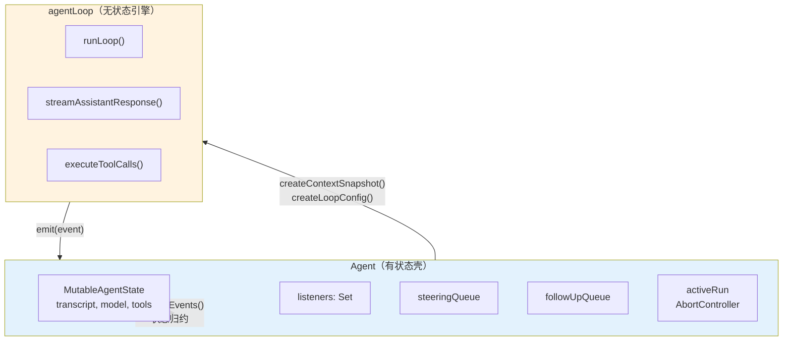

# 第 10 章：`Agent` — 循环之上的有状态壳

> **定位**：本章解析为什么一个无状态循环引擎之上还需要一个有状态的 `Agent` 类。
> 前置依赖：第 8 章（agentLoop）、第 9 章（工具执行管道）。
> 适用场景：当你想理解"循环"和"运行时对象"为什么必须分开，或者想为自己的 agent 系统设计状态管理。

## 为什么循环引擎不够？

第 8 章展示了 `agentLoop` 的无状态设计。但一个真正可用的 agent 需要更多：

- 它需要**记住**对话历史（transcript）
- 它需要**通知**多个订阅者关于状态变化（listeners）
- 它需要**接收**用户在执行过程中发来的消息（queues）
- 它需要**能被中断**（abort）
- 它需要**防止**同时运行两次（mutual exclusion）

这些都是有状态的需求。如果把它们塞进循环引擎，循环就不再是纯函数了 — 它会变成一个"知道太多"的上帝对象。

pi 的解决方案是在循环引擎之上套一个有状态的壳：`Agent` 类。循环引擎负责"转"，`Agent` 负责"管"。



`Agent` 向循环引擎提供两样东西：一个 context 快照（`createContextSnapshot`）和一个配置对象（`createLoopConfig`）。循环引擎通过事件回调（`emit`）把产出送回 `Agent`，`Agent` 在 `processEvents()` 中做状态归约。

## `Agent` 拥有什么

让我们逐一看 `Agent` 管理的五类状态。

### 1. MutableAgentState — 受控的可变状态

`Agent` 的核心状态是一个 `MutableAgentState` 对象。它的类型定义从公开的 `AgentState` 接口派生，去掉 `readonly` 约束：

```typescript
// packages/agent/src/agent.ts:60-65

type MutableAgentState = Omit<AgentState, "isStreaming" | "streamingMessage" | "pendingToolCalls" | "errorMessage"> & {
  isStreaming: boolean;
  streamingMessage?: AgentMessage;
  pendingToolCalls: Set<string>;
  errorMessage?: string;
};
```

`MutableAgentState` 通过一个工厂函数创建，而不是直接构造：

```typescript
// packages/agent/src/agent.ts:67-94（简化）

function createMutableAgentState(
  initialState?: Partial<Omit<AgentState, "pendingToolCalls" | "isStreaming" | "streamingMessage" | "errorMessage">>,
): MutableAgentState {
  let tools = initialState?.tools?.slice() ?? [];
  let messages = initialState?.messages?.slice() ?? [];

  return {
    systemPrompt: initialState?.systemPrompt ?? "",
    model: initialState?.model ?? DEFAULT_MODEL,
    thinkingLevel: initialState?.thinkingLevel ?? "off",
    get tools() {
      return tools;
    },
    set tools(nextTools: AgentTool<any>[]) {
      tools = nextTools.slice();
    },
    get messages() {
      return messages;
    },
    set messages(nextMessages: AgentMessage[]) {
      messages = nextMessages.slice();  // <- 总是 copy
    },
    isStreaming: false,
    streamingMessage: undefined,
    pendingToolCalls: new Set<string>(),
    errorMessage: undefined,
  };
}
```

这里有一个精巧的设计：`tools` 和 `messages` 使用 getter/setter 属性。当你赋值 `state.messages = newArray` 时，setter 会自动调用 `newArray.slice()` — 它总是存储一个副本。

为什么要这样做？因为 `AgentMessage[]` 会被传递给循环引擎（`createContextSnapshot`）。如果不 copy，循环引擎修改数组时会直接影响 `Agent` 的状态，两者的状态就耦合了。copy-on-assign 保证了 `Agent` 的状态和循环引擎的工作数据是独立的。

在公开的 `AgentState` 接口中，`isStreaming`、`streamingMessage`、`pendingToolCalls`、`errorMessage` 这四个字段是 `readonly` 的：

```typescript
// packages/agent/src/types.ts:322-347

interface AgentState {
  systemPrompt: string;
  model: Model<any>;
  thinkingLevel: ThinkingLevel;
  set tools(tools: AgentTool<any>[]);
  get tools(): AgentTool<any>[];
  set messages(messages: AgentMessage[]);
  get messages(): AgentMessage[];
  readonly isStreaming: boolean;
  readonly streamingMessage?: AgentMessage;
  readonly pendingToolCalls: ReadonlySet<string>;
  readonly errorMessage?: string;
}
```

外部代码（UI 组件、extension）通过 `agent.state` 读取这些字段，但不能直接修改它们。只有 `Agent` 内部的 `processEvents()` 可以修改。这保证了运行时状态的单一真相源。

### 2. 事件订阅 — 有序且受信号保护

```typescript
// packages/agent/src/agent.ts:173, 241-244
export class Agent {
  ...
  private readonly listeners = new Set<(event: AgentEvent, signal: AbortSignal) => Promise<void> | void>();
  ...
  subscribe(listener): () => void {
    this.listeners.add(listener);
    return () => this.listeners.delete(listener);
  }
  ...
}
```

订阅模式的三个设计选择：

**1. listener 接收 AbortSignal**。每个 listener 都能感知当前 run 的中止信号。如果一个 listener 在处理事件时发现 `signal.aborted`，它可以选择跳过耗时操作（比如持久化）。

**2. listener 的 Promise 被 await**。`processEvents` 中的代码是：

```typescript
for (const listener of this.listeners) { // ts 中的集合可以按照插入顺序迭代集合中的元素插入顺序
  await listener(event, signal);
}
```

这意味着 listener 按注册顺序串行执行。一个慢的 listener 会阻塞后续 listener。这是故意的 — 它保证了状态归约和事件通知的顺序一致性。如果 listener 并行执行，两个 listener 可能同时读到不一致的中间状态。

**3. `agent_end` 不等于 idle**。`agent_end` 事件只意味着循环引擎不再发射事件了。但 `Agent` 要等到**所有 listener 处理完 `agent_end`** 后才算真正 idle。这就是 `waitForIdle()` 和 `agent_end` 的区别：

```typescript
// packages/agent/src/agent.ts:319-321

waitForIdle(): Promise<void> {
  return this.activeRun?.promise ?? Promise.resolve();
}
```

`activeRun.promise` 在 `finishRun()` 中 resolve，而 `finishRun()` 在所有 listener 处理完毕之后才被调用。

### 3. 消息队列 — 两种节奏的输入

```typescript
// packages/agent/src/agent.ts:123-157

class PendingMessageQueue {
  private messages: AgentMessage[] = [];
  public mode: QueueMode;

  constructor(mode: QueueMode) {
    this.mode = mode;
  }

  enqueue(message: AgentMessage): void {
    this.messages.push(message);
  }

  hasItems(): boolean {
    return this.messages.length > 0;
  }

  drain(): AgentMessage[] {
    if (this.mode === "all") {
      const drained = this.messages.slice();
      this.messages = [];
      return drained;
    }

    const first = this.messages[0];
    if (!first) {
      return [];
    }
    this.messages = this.messages.slice(1);
    return [first];
  }

  clear(): void {
    this.messages = [];
  }
}
```

`Agent` 持有两个独立的消息队列：

- `steeringQueue`：`agent.steer(msg)` 入队，在 turn 间隙被消费
- `followUpQueue`：`agent.followUp(msg)` 入队，在 agent 本来要退出（run 结束）时被消费

每个队列有两种 drain 模式：

- `"all"`：一次性取出所有排队的消息
- `"one-at-a-time"`（默认）：一次只取一条，剩余的留到下次

为什么默认是 `one-at-a-time`？考虑这个场景：用户在 agent 执行 bash 命令时快速输入了三条 steering 消息。如果用 `"all"` 模式，三条消息会同时注入 context，LLM 需要一次理解三条指令。如果用 `"one-at-a-time"`，LLM 先处理第一条，在下一个 turn 间隙再收到第二条 — 就像人类对话中逐条回应，而不是一次性面对一堆请求。

除了 `steer()` 和 `followUp()` 入队方法，`Agent` 还提供了一组队列管理 API：

```typescript
// packages/agent/src/agent.ts:284-302

clearSteeringQueue(): void { this.steeringQueue.clear(); }
clearFollowUpQueue(): void { this.followUpQueue.clear(); }
clearAllQueues(): void {
  this.clearSteeringQueue();
  this.clearFollowUpQueue();
}
hasQueuedMessages(): boolean {
  return this.steeringQueue.hasItems() || this.followUpQueue.hasItems();
}
```

`clearAllQueues()` 和 `hasQueuedMessages()` 在 `reset()` 和 UI 交互中很有用 — 前者让调用者一次清空所有待处理消息，后者让调用者在决定是否可以安全退出时检查是否还有排队的消息。

队列和循环引擎的对接发生在 `createLoopConfig()` 中：

```typescript
// packages/agent/src/agent.ts:432-466（简化）

private createLoopConfig(options: { skipInitialSteeringPoll?: boolean } = {}
): AgentLoopConfig {
  let skipInitialSteeringPoll = options.skipInitialSteeringPoll === true;
  return {
    // ... 其他字段 ...
    getSteeringMessages: async () => {
      if (skipInitialSteeringPoll) {
        skipInitialSteeringPoll = false;
        return [];
      }
      return this.steeringQueue.drain();
    },
    getFollowUpMessages: async () => this.followUpQueue.drain(),
  };
}
```

`Agent` 把队列的 `drain()` 方法包装成循环引擎需要的 `getSteeringMessages` 和 `getFollowUpMessages` 回调。循环引擎不知道消息从哪来 — 它只管调用回调取消息。

注意 `skipInitialSteeringPoll` 参数 — 当 `continue()` 发现最后一条消息是 assistant 角色时，它会先手动排空 steering 队列作为新的 prompt，然后通过 `skipInitialSteeringPoll: true` 告诉循环引擎跳过第一次 steering 轮询，避免同一批消息被消费两次。

### 4. 中止控制 — 一个 AbortController 管全局

```typescript
// packages/agent/src/agent.ts:469-492（简化）

private async runWithLifecycle(
  executor: (signal: AbortSignal) => Promise<void>
): Promise<void> {
  if (this.activeRun) {
    throw new Error("Agent is already processing.");
  }

  const abortController = new AbortController();
  let resolvePromise = () => {};
  const promise = new Promise<void>((resolve) => {
    resolvePromise = resolve;
  });
  this.activeRun = { promise, resolve: resolvePromise, abortController };

  this._state.isStreaming = true;
  this._state.streamingMessage = undefined;
  this._state.errorMessage = undefined;

  try {
    await executor(abortController.signal);
  } catch (error) {
    // 安全网：即使循环违反了"must not throw"契约，
    // Agent 也能合成一条失败消息而不是崩溃
    await this.handleRunFailure(
      error, abortController.signal.aborted
    );
  } finally {
    this.finishRun();
  }
}
```

`runWithLifecycle` 在启动执行器之前，除了设置 `isStreaming = true`，还会主动清空 `streamingMessage` 和 `errorMessage`。这保证了每次 run 从一个干净的运行时状态开始，不会残留上一次 run 的错误信息或流式消息。

`Agent` 还提供了 `continue()` 方法，它调用循环引擎的 `runAgentLoopContinue` — 从当前 transcript 继续，而不添加新的 prompt。当最后一条消息是 assistant 角色时，`continue()` 会先尝试排空 steering 队列或 follow-up 队列作为新的 prompt：

```typescript
// packages/agent/src/agent.ts:348-375（简化）

async continue(): Promise<void> {
  // ... 互斥检查 ...
  const lastMessage = this._state.messages[this._state.messages.length - 1];

  if (lastMessage.role === "assistant") {
    const queuedSteering = this.steeringQueue.drain();
    if (queuedSteering.length > 0) {
      await this.runPromptMessages(queuedSteering, { skipInitialSteeringPoll: true });
      return;
    }

    const queuedFollowUps = this.followUpQueue.drain();
    if (queuedFollowUps.length > 0) {
      await this.runPromptMessages(queuedFollowUps);
      return;
    }

    throw new Error("Cannot continue from message role: assistant");
  }

  await this.runContinuation();
}
```

这是 Agent 和循环引擎之间的一个精巧协调 — `continue()` 根据最后一条消息的角色选择不同的恢复策略。

每次 `prompt()` 或 `continue()` 调用都会创建一个新的 `AbortController`。它的 signal 被传递给循环引擎、所有 listener、所有工具执行。`Agent` 通过 `signal` getter 将当前 run 的信号暴露给外部：

```typescript
// packages/agent/src/agent.ts:305-312

get signal(): AbortSignal | undefined {
  return this.activeRun?.abortController.signal;
}

abort(): void {
  this.activeRun?.abortController.abort();
}
```

一个 `abort()` 调用就能中止整条链：LLM 流式响应被取消 -> 工具执行被中止 -> 循环退出。`signal` getter 让外部代码（比如 `prepareNextTurn` 回调）也能感知中止状态。

### 5. 互斥锁 — 禁止重入

```typescript
async prompt(input): Promise<void> {
  if (this.activeRun) {
    throw new Error(
      "Agent is already processing a prompt. " +
      "Use steer() or followUp() to queue messages, " +
      "or wait for completion."
    );
  }
  // ...
}
```

`Agent` 通过检查 `activeRun` 来防止同时运行两个循环。这不是用 Mutex 实现的，而是一个简单的存在性检查 — 如果 `activeRun` 存在，说明有循环在跑，新的 `prompt()` 调用会抛异常。

注意错误信息的设计：它不只是说"不行"，还告诉调用者**应该怎么做** — "Use steer() or followUp() to queue messages, or wait for completion." 错误信息本身就是 API 文档。

## `processEvents`：状态归约器

`Agent` 接收循环引擎发射的事件，并在 `processEvents()` 中做状态归约。这个方法的逻辑类似 Redux 的 reducer — 给定当前状态和一个事件，更新状态 — 但不同于 Redux 的纯函数语义，这里是直接 mutation：

```typescript
// packages/agent/src/agent.ts:527-574（简化）

private async processEvents(event: AgentEvent): Promise<void> {
  switch (event.type) {
    case "message_start":
      this._state.streamingMessage = event.message;
      break;

    case "message_update":
      this._state.streamingMessage = event.message;
      break;

    case "message_end":
      this._state.streamingMessage = undefined;
      this._state.messages.push(event.message);
      break;

    case "tool_execution_start": {
      const pendingToolCalls = new Set(this._state.pendingToolCalls);
      pendingToolCalls.add(event.toolCallId);
      this._state.pendingToolCalls = pendingToolCalls;
      break;
    }

    case "tool_execution_end": {
      const pendingToolCalls = new Set(this._state.pendingToolCalls);
      pendingToolCalls.delete(event.toolCallId);
      this._state.pendingToolCalls = pendingToolCalls;
      break;
    }

    case "turn_end":
      if (event.message.role === "assistant"
        && event.message.errorMessage) {
        this._state.errorMessage = event.message.errorMessage;
      }
      break;

    case "agent_end":
      this._state.streamingMessage = undefined;
      break;
  }

  // 先归约状态，再通知 listener
  const signal = this.activeRun?.abortController.signal;
  if (!signal) {
    throw new Error("Agent listener invoked outside active run");
  }
  for (const listener of this.listeners) {
    await listener(event, signal);
  }
}
```

几个值得注意的设计细节：

**1. `pendingToolCalls` 每次修改都创建新 Set**。`tool_execution_start` 和 `tool_execution_end` 不是在原 Set 上 add/delete，而是创建一个新的 Set 再赋值。这是因为 `AgentState.pendingToolCalls` 是 `ReadonlySet` — 外部代码持有的引用不会被意外修改。新建 Set 保证了不可变语义。

**2. 状态归约在 listener 通知之前**。`switch` 语句先更新状态，然后才 `for` 循环通知 listener。这意味着 listener 在收到 `message_end` 事件时，`state.messages` 已经包含了这条消息，`state.streamingMessage` 已经被清空。listener 总是看到一致的状态。

**3. 不是所有事件都有状态变更**。`agent_start`、`turn_start`、`tool_execution_update` 都没有对应的状态修改 — 它们只被透传给 listener。归约器只处理真正影响状态的事件。

**4. signal 空值保护是硬性断言**。如果 `processEvents` 在没有活跃 run 的情况下被调用（`activeRun` 为空），它会直接 `throw` 而不是静默降级。这是一个不变量保护 — 如果触发了，说明 Agent 的生命周期管理出了 bug，应该被立即发现。

## `createLoopConfig`：Agent 到循环引擎的桥梁

`Agent` 作为有状态的管理者，并不自己执行 AI 生成和工具调用的复杂流程，而是将核心逻辑委托给无状态的 `agentLoop`（即 `runAgentLoop` 和 `runAgentLoopContinue` 函数）。为了实现这种解耦，`Agent` 必须在每次启动运行（run）时，将其自身的状态和方法“翻译”成底层引擎可以理解的纯配置对象 —— 即 `AgentLoopConfig`。

`createLoopConfig()` 正是承担这一使命的核心方法。它不仅负责简单地透传字段，更重要的是对接口差异、生命周期和队列进行精细的适配。

```typescript
// packages/agent/src/agent.ts:432-467

private createLoopConfig(options: { skipInitialSteeringPoll?: boolean } = {}): AgentLoopConfig {
  let skipInitialSteeringPoll = options.skipInitialSteeringPoll === true;
  return {
    model: this._state.model,
    reasoning: this._state.thinkingLevel === "off" ? undefined : this._state.thinkingLevel,
    sessionId: this.sessionId,
    onPayload: this.onPayload,
    onResponse: this.onResponse,
    transport: this.transport,
    thinkingBudgets: this.thinkingBudgets,
    maxRetryDelayMs: this.maxRetryDelayMs,
    toolExecution: this.toolExecution,
    beforeToolCall: this.beforeToolCall,
    afterToolCall: this.afterToolCall,
    prepareNextTurn:
      this.prepareNextTurnWithContext || this.prepareNextTurn
        ? async (context) => {
            if (this.prepareNextTurnWithContext) {
              return await this.prepareNextTurnWithContext(context, this.signal);
            }
            return await this.prepareNextTurn?.(this.signal);
          }
        : undefined,
    convertToLlm: this.convertToLlm,
    transformContext: this.transformContext,
    getApiKey: this.getApiKey,
    getSteeringMessages: async () => {
      if (skipInitialSteeringPoll) {
        skipInitialSteeringPoll = false;
        return [];
      }
      return this.steeringQueue.drain();
    },
    getFollowUpMessages: async () => this.followUpQueue.drain(),
  };
}
```

详细剖析其工作原理和设计巧思，主要体现在以下四个维度：

### 1. 状态读取与参数透传（State Projection）

循环引擎不知道 `Agent` 的存在，因此 `createLoopConfig` 会抓取 `Agent` 的当前快照并扁平化：

- **静态配置传递**：将 `model`、`sessionId`、`transport`、`maxRetryDelayMs` 等直接赋予配置对象。
- **流控制参数透传**：`thinkingBudgets`（思考 token 预算）、`onPayload` / `onResponse`（底层 HTTP 监控），以及 `toolExecution`（工具并发/串行模式）直接交由循环引擎指导 LLM 请求和工具执行行为。
- **回调函数交接**：`convertToLlm`、`transformContext`、`beforeToolCall` 等挂载在 Agent 实例上的函数会直接注入引擎，以便在内部调用。

### 2. 枚举与语意的转换（Semantic Mapping）

由于 `Agent` 暴露给上层的 API 可能更贴近用户直觉，而 `agentLoop` 需要更贴近 AI 提供商的规范，此方法需要做自动转换：

- **`thinkingLevel` 到 `reasoning` 的映射**：`Agent` 使用 `ThinkingLevel` 类型定义不同的思考强度（`"off" | "minimal" | "low" | "medium" | "high" | "xhigh"`）。但在底层引擎，如果不启用推理，通常期望传递 `undefined`，于是 `createLoopConfig` 将 `"off"` 转换为 `undefined`，其余强度值直接透传。

### 3. 方法签名适配与 AbortSignal 注入（Adapter Pattern）

`Agent` 提供给开发者的回调函数签名，比底层引擎要求的函数往往更灵活或者额外附加了生命周期信息：

- **`prepareNextTurn` 的双版本合并**：为了方便不同的使用场景，`Agent` 暴露了两种 `prepareNextTurn` 钩子：一种无需参数（`prepareNextTurn`），一种带上下文参数（`prepareNextTurnWithContext`）。底层引擎期望只拿到一个 `(context) => Promise` 函数。`createLoopConfig` 将这二者封装成统一的闭包，并优先使用带 Context 的版本。
- **动态的 `signal` 注入**：在合并后的 `prepareNextTurn` 闭包中，代码特地传入了 `this.signal`。当底层引擎执行到决策下一步轮次时触发闭包，`Agent` 便通过该机制将当前的全局中止 `AbortSignal` 送达给回调函数的实现者，这使得外部能实时感知 Agent 的打断行为。

### 4. 队列驱动与闭包状态维护（Queue Polling & Closure State）

这部分是衔接“异步外部输入队列”和“同步循环流”的关键一环：

- **将 `Queue` 对象化身为 Polling 回调**：循环引擎不关心是否有 `steeringQueue` 或 `followUpQueue` 这种管理实体，它只期待按需调用 `getSteeringMessages()` 和 `getFollowUpMessages()` 两个异步数据拉取回调。`createLoopConfig` 提供匿名函数包装了 `this.steeringQueue.drain()`。它实现了漂亮的控制反转：引擎需要数据时调用，Agent 在其后方抽水供血。
- **`skipInitialSteeringPoll` 的一次性放行机制**：当通过 `continue()` 恢复包含新排队信息的交互时，可能由于已经在恢复主入口排空了队列，如果引擎起跑后在第一轮 turn 马上再拉取一次，就会导致意外行为。`createLoopConfig` 利用闭包声明局部的 `let skipInitialSteeringPoll`，当且仅当第一次执行且为 true 时直接拦截并返回空数组 `[]`，并将标志置为 `false`。它优雅地维护了“过滤首轮”的状态，避免了在外部或全局留下多余的状态痕迹。

## `CustomAgentMessages`：类型安全的扩展点

`Agent` 管理的 `messages` 数组的类型是 `AgentMessage[]`。这个类型的定义隐藏了一个精妙的扩展机制：

```typescript
// packages/agent/src/types.ts:305-314

// 默认为空 — 应用通过声明合并扩展
export interface CustomAgentMessages {
  // Empty by default
}

// AgentMessage = LLM 消息 + 所有自定义消息
export type AgentMessage =
  Message | CustomAgentMessages[keyof CustomAgentMessages];
```

`CustomAgentMessages` 是一个空接口，但它使用了 TypeScript 的声明合并（declaration merging）。应用层可以这样扩展它：

```typescript
// 在 pi-coding-agent 中
declare module "@earendil-works/pi-agent-core" {
  interface CustomAgentMessages {
    custom: CustomMessage;        // compaction 摘要、分支标记等
    bashExecution: BashMessage;   // bash 工具的结构化结果
  }
}
```

扩展之后，`AgentMessage` 自动变成：

```typescript
type AgentMessage =
  | Message          // user, assistant, toolResult
  | CustomMessage    // compaction, branch, notification
  | BashMessage;     // bash 结构化结果
```

**为什么不用普通的联合类型？**

如果把自定义消息硬编码到联合类型里，pi-agent-core 就需要知道 pi-coding-agent 的消息类型 — 依赖方向反了。声明合并让 pi-agent-core 定义框架（空的 `CustomAgentMessages`），pi-coding-agent 填充内容，依赖方向保持正确。

**为什么不用 `any` 或泛型？**

用 `any` 会丢失类型安全。用泛型 `Agent<TMessage>` 会让每个使用 Agent 的地方都要传类型参数。声明合并在全局生效，不需要传递类型参数，所有使用 `AgentMessage` 的地方自动包含自定义类型。

这和 `convertToLlm` 回调配合形成完整的设计：自定义消息在循环内部是一等公民（类型安全、可以被 `transformContext` 处理），在出门见 LLM 时被 `convertToLlm` 过滤掉。类型系统保证你不会忘记处理某种自定义消息。

## Agent 不管什么

理解 `Agent` 的边界和理解它的能力同样重要。以下是 `Agent` 明确不管的事情：

| 关注点              | Agent 的态度                         | 谁管                       |
| ---------------- | --------------------------------- | ------------------------ |
| 会话持久化            | 不知道"会话"的存在                        | SessionManager（第 11 章）   |
| UI 渲染            | 只发射事件，不管谁听                        | TUI / Web UI（第 24 章）     |
| 认证               | 通过 `getApiKey` 回调获取，不管 token 怎么来的 | OAuth 模块（第 7 章）          |
| 模型选择             | 只持有一个 `model` 字段，不管怎么选的           | ModelRegistry（第 18 章）    |
| Context 压缩       | 通过 `transformContext` 委托，不管怎么压    | Compaction（第 12 章）       |
| System prompt 拼接 | 只持有一个 `systemPrompt` 字符串          | system-prompt.ts（第 14 章） |
| 工具注册             | 只持有 `tools[]`，不管工具从哪来             | Extension（第 15 章）        |
| Turn 间策略         | 通过 `prepareNextTurn` 委托，不管怎么决策    | 上层编排（第 12、18 章）          |
| 提前终止             | 通过 `shouldStopAfterTurn` 委托给循环引擎  | AgentLoopConfig 调用者      |

这张表揭示了一个设计原则：**Agent 只管运行时状态，不管配置和策略。** 它知道自己正在用什么模型（`state.model`），但不知道为什么选这个模型。它知道有哪些工具可用（`state.tools`），但不知道这些工具是怎么被发现和注册的。它知道 system prompt 是什么（`state.systemPrompt`），但不知道 prompt 是怎么从多个来源拼接出来的。

## 取舍分析

### 得到了什么

**1. 清晰的职责边界**。循环引擎是纯计算，Agent 是状态管理。两者可以独立演进 — 改循环逻辑不影响状态管理，改状态结构不影响循环逻辑。

**2. 可预测的状态变更**。所有状态修改都通过 `processEvents()` 这一个入口。想知道某个状态字段什么时候会变？只需要在 `processEvents()` 的 `switch` 语句中搜索。

**3. 灵活的消费者模型**。`subscribe()` 让任意多个消费者同时观察 Agent 的行为。TUI 订阅事件来渲染，session manager 订阅事件来持久化，extension 订阅事件来做自定义逻辑 — 它们互不干扰。

### 放弃了什么

**1. Agent 是一个胖接口**。`Agent` 类有 30+ 个公开方法和属性（包括 `subscribe`、`prompt`、`continue`、`steer`、`followUp`、`abort`、`waitForIdle`、`reset`、`clearSteeringQueue`、`clearFollowUpQueue`、`clearAllQueues`、`hasQueuedMessages` 等方法，以及 `convertToLlm`、`transformContext`、`beforeToolCall`、`afterToolCall`、`prepareNextTurn`、`prepareNextTurnWithContext`、`streamFn`、`sessionId`、`transport`、`thinkingBudgets`、`maxRetryDelayMs`、`toolExecution`、`onPayload`、`onResponse`、`signal` 等可配置字段和访问器）。如果你只想跑一个简单的 agent 循环，直接调用 `runAgentLoop()` 比创建一个 Agent 实例更直接。Agent 的价值在有状态、有交互的场景，对于一次性脚本反而是负担。

**2. 状态同步依赖事件顺序**。因为 listener 串行执行，一个慢的 listener（比如写磁盘的 session manager）会延迟后续 listener（比如渲染 UI 的 TUI）收到事件的时间。在实践中这通常不是问题（listener 的处理时间远小于 LLM 响应时间），但在极端情况下可能导致 UI 延迟。

**3. Agent 是单线程模型**。同一时间只能有一个 `prompt()` 或 `continue()` 在运行。这意味着不能实现"后台持续运行、前台随时查询"的模式。如果需要这种模式，必须在 Agent 之上再包一层异步调度器。

---

### 版本演化说明

> 本章核心分析基于 pi-mono v0.80.3。`Agent` 类的核心结构自引入以来保持稳定。
> 
> 与 v0.66.0 相比的主要变化：`MutableAgentState` 改为通过 `createMutableAgentState()` 工厂函数
> 创建，`ThinkingLevel` 新增 `"xhigh"` 级别，新增 `ToolExecutionMode`（`"sequential" | "parallel"`）
> 控制工具调用的并发策略，`PendingMessageQueue` 新增 `hasItems()` 和 `clear()` 方法，`Agent` 新增
> `clearSteeringQueue()`、`clearFollowUpQueue()`、`clearAllQueues()`、`hasQueuedMessages()` 队列管理
> 方法以及 `signal` getter，新增 `prepareNextTurnWithContext`、`thinkingBudgets`、`transport`、
> `maxRetryDelayMs`、`toolExecution`、`onPayload`、`onResponse` 等可配置字段，`runWithLifecycle` 在
> 启动时主动清空 `streamingMessage` 和 `errorMessage`，`continue()` 引入 `skipInitialSteeringPoll`
> 机制避免 steering 消息被重复消费。循环引擎侧新增 `shouldStopAfterTurn` 和 `prepareNextTurn` 回调，
> 包名从 `@mariozechner/agent` 更名为 `@earendil-works/pi-agent-core`。
